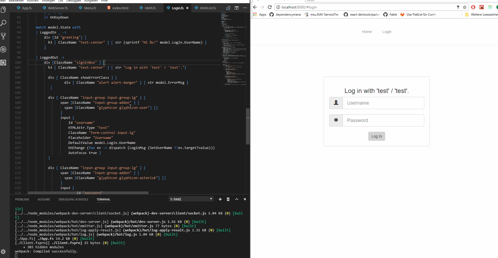

Elmish-HMR: [Hot Module Replacement](https://webpack.js.org/concepts/hot-module-replacement/) integration for [fable-elmish](https://github.com/fable-compiler/fable-elmish) applications.
=======

[](https://ci.appveyor.com/project/MangelMaxime/hmr/branch/master)
[](https://travis-ci.org/fable-elmish/hmr)
[](https://badge.fury.io/nu/Fable.Elmish.HMR)

For more information see [the docs](https://fable-elmish.github.io/debugger).

## Installation
```shell
paket add nuget Fable.Elmish.HMR
```

## Demo


